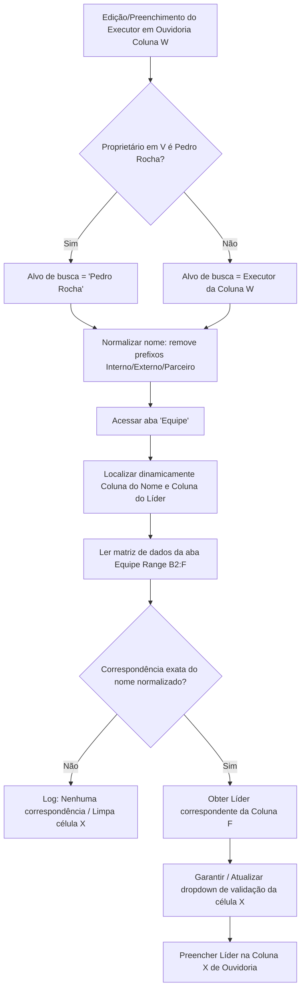

# Fluxo de Leitura da Aba Equipe (Ouvidoria)

**Data**: 2026-09-22  
**Projeto**: [[Visão Geral - Webhook Appscript]]  
**Tags**: #ouvidoria #aba-equipe #leitura-dados #lider #planilha

---

## 📌 Contexto da Pergunta
Detalhamento técnico do fluxo atual de leitura da aba **"Equipe"** para identificação e preenchimento automático do Líder na planilha de Ouvidoria.

---

## 🔄 Etapas do Fluxo de Leitura

---

## 🔍 Regras Chave do Fluxo

1. **Descoberta Dinâmica de Cabeçalhos**:
   - Coluna de Nome: Busca `['NOME']` (fallback: coluna 2 / B).
   - Coluna de Líder: Busca `['LIDER', 'LÍDER']` (fallback: coluna 6 / F).
2. **Normalização Textual**: Remove acentuação, espaços extras e caixa alta/baixa tanto no nome procurado quanto no cadastro da aba Equipe.
3. **Casos Especiais**:
   - Se o responsável em V for Pedro Rocha (terceiros/parceiros), busca automaticamente o líder de Pedro Rocha na aba Equipe.
   - Trata múltiplos nomes separados por barra vertical `|`.
4. **Sincronização com o Dropdown (Data Validation)**:
   - Se o líder encontrado não constar no dropdown da célula, a função lê todos os líderes da coluna F da aba Equipe e atualiza a regra de validação da célula antes de preencher.

---
*Conexões*:
- Diário: [[2026-09-22 - Log de Dúvidas e Buscas]]
- Projeto: [[Visão Geral - Webhook Appscript]]
- Nota Relacionada: [[Mapeamento Colunas Aba Equipe Ouvidoria]]

