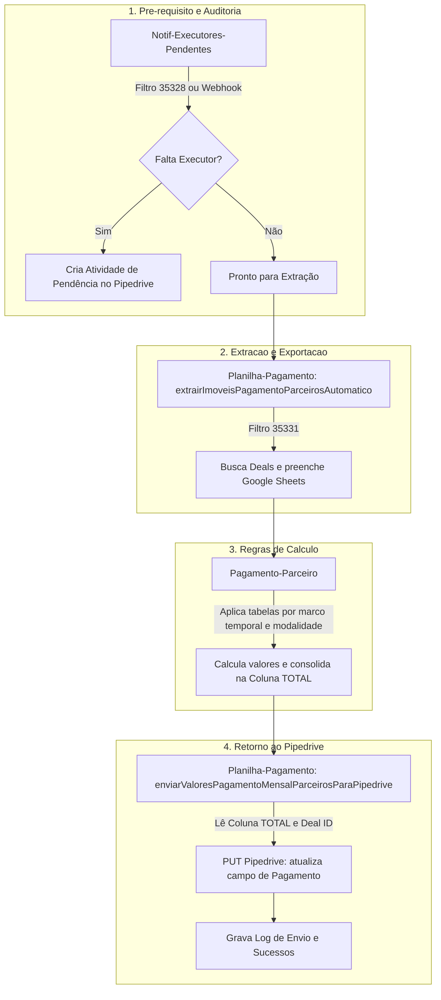

# Análise de Fluxo e Conexão no Projeto Financeiro-terceiros

## Pergunta
O código fornecido é do mesmo projeto analisado? Qual a conexão e o fluxo entre as funções e arquivos de `Financeiro-terceiros`?

## Resposta e Análise Técnica
**Sim, o código colado é exatamente o arquivo `Planilha-Pagamento`**, que compõe o módulo `Financeiro-terceiros` juntamente com `Pagamento-Parceiro`, `Notif-Executores-Pendentes` e `webhook`.

### Conexão e Fluxo de Ponta a Ponta:

### Papel de Cada Arquivo no Ciclo:
1. **`Notif-Executores-Pendentes`**: Garante que os dados (Executores de ITBI, Contrato, Registro, Titularidade, Leilões e Data do Formulário) estejam 100% preenchidos antes da extração.
2. **`Planilha-Pagamento` (Extração)**: Roda via gatilho semanal (segundas e sextas às 08h) e extrai os imóveis do filtro `35331` para a planilha.
3. **`Pagamento-Parceiro` (Regras de Negócio)**: Contém a lógica de precificação das etapas conforme a data do formulário e forma de pagamento.
4. **`Planilha-Pagamento` (Envio)**: Lê os valores consolidados na planilha e faz o `PUT` no campo customizado `d1dcf6df609d2f351e88be11ca985ba86b0a03cc` no Pipedrive com controle de duplicidade.

## Referências
- [[Visão Geral Financeiro-terceiros]]
- [[Pagamento-Parceiro]]
- [[Planilha-Pagamento]]
- [[2026-09-25 - Log de Dúvidas e Buscas]]
