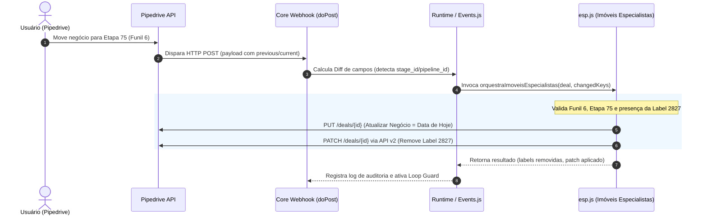

# Relacionamento entre esp.js e a Arquitetura de Webhooks

**Data**: 2026-09-22  
**Projeto**: [[Visão Geral - Webhook Appscript]]  
**Tags**: #imoveis-especialistas #webhooks #arquitetura-davi #pipedrive #ciclo-de-vida

---

## 📌 Contexto da Pergunta
Resumo e explicação de como a automação `esp.js` (Imóveis Especialistas) se conecta e se relaciona com a arquitetura central de Webhooks do sistema (Webhook Davi).

---

## 🔄 Fluxo de Integração e Ciclo de Vida

---

## 🔑 Principais Pontos de Integração

1. **Inscrição de Gatilhos (`Trigger Keys`)**:
   - `esp.js` declara interesse nas chaves `stage_id` e `pipeline_id`. O roteador só ativa a automação quando essas chaves sofrem alteração.
2. **Declaração de Saída (`Output Keys`)**:
   - Informa ao runtime quais campos ela modifica (`ec2bb78eff202879d3daaef8687600f9bd982aa3`, `label`, `label_ids`).
3. **Prevenção de Loop (Loop Guard)**:
   - Quando o Pipedrive notifica o webhook sobre a remoção da label que a própria automação acabou de fazer, o Core reconhece o `dealId` no cache de saída e descarta o evento, evitando repetições infinitas.

---
*Conexões*:
- Diário: [[2026-09-22 - Log de Dúvidas e Buscas]]
- Projeto: [[Visão Geral - Webhook Appscript]]
- Nota Relacionada: [[Fluxo Remocao Tag Especialistas esp.js]]

